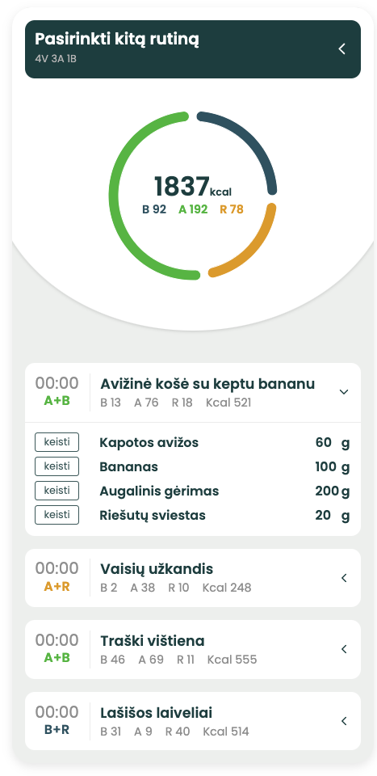

# Hi there, I'm Mikas Dulevičius 👋

#### I'm a web developer passionate about creating meaningful digital experiences.

## 🚀 Technologies & Skills

* **Frontend:**
  * JavaScript
  * React.js
  * Learning: TypeScript, Next.js

* **Backend:**
  * Node.js
  * Express.js
  * Learning: GraphQL

* **Database:**
  * PostgreSQL

## 💼 Current Project - www.bezalos.lt - healthy nutrition

### Interactive nutrition plan

## 🌱 I'm currently learning

* TypeScript
* Next.js
* GraphQL
* Docker

## 📫 How to reach me
- **LinkedIn:** (https://www.linkedin.com/in/mikas-d-79654099)

## 📊 GitHub Stats

