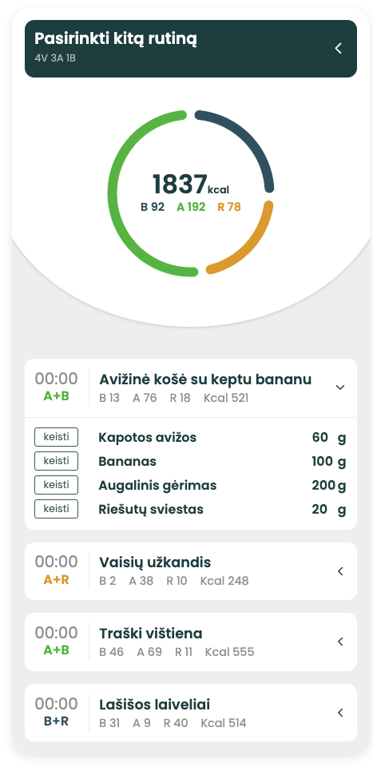

# Hi there, I'm Mikas Dulevičius 👋

<div align="center">

### Web Developer | Building Meaningful Digital Experiences

[](https://www.linkedin.com/in/mikas-d-79654099)
[](https://github.com/mikas1213)

</div>

---

## 🚀 Tech Stack

### Frontend


### Backend


### Other Tools


---

## 💼 Featured Project

### 🥗 [Bezalos.lt](https://www.bezalos.lt) - Healthy Nutrition Platform

A modern web application for creating and managing personalized nutrition plans with an interactive interface.

**Key Features:**
- 📊 Interactive nutrition plan visualization
- 🎯 Personalized meal planning
- 📱 Responsive design for all devices
- ⚡ Fast and intuitive user experience

**Tech Stack:**
- Frontend: React.js, JavaScript, CSS3
- Backend: Node.js, Express.js
- Database: PostgreSQL

### Interactive nutrition plan


---

## 🌱 Currently Learning

```javascript
const currentlyLearning = {
    languages: ['TypeScript'],
    frameworks: ['TanStack Query', 'TanStack Table'],
    technologies: ['Zod', 'Docker', 'Nginx'],
    focus: 'Building scalable full-stack applications'
};
```

---

## 📫 Get in Touch

- 💼 **LinkedIn:** [Mikas Dulevičius](https://www.linkedin.com/in/mikas-d-79654099)
- 🐙 **GitHub:** [@mikas1213](https://github.com/mikas1213)
- 🌐 **Website:** [bezalos.lt](https://www.bezalos.lt)

---

## 📊 GitHub Stats

<div align="center">


</div>

---

<div align="center">

### ⭐ From [mikas1213](https://github.com/mikas1213)

*"Code is like humor. When you have to explain it, it's bad."* – Cory House

</div>
